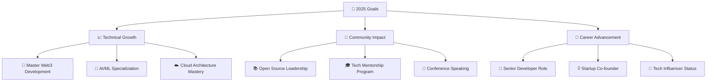

<div align="center">

#  Welcome to **Devarshi's Digital Universe** 


<br/>

<!-- Animated Banner -->


</div>

---

## 🎯 **Digital Identity Matrix** 

<div align="center">

<table>
<tr>
<td align="center" width="20%">

<br/><b>⚡ JavaScript</b>
<br/>
<div style="width: 100%; background: #1e2139; border-radius: 10px;">
<div style="width: 95%; background: linear-gradient(90deg, #FF6B6B, #4ECDC4); height: 20px; border-radius: 10px;"></div>
</div>
<sub>Expert Level - 95%</sub>
</td>
<td align="center" width="20%">

<br/><b>🐍 Python</b>
<br/>
<div style="width: 100%; background: #1e2139; border-radius: 10px;">
<div style="width: 90%; background: linear-gradient(90deg, #45B7D1, #96CEB4); height: 20px; border-radius: 10px;"></div>
</div>
<sub>Advanced - 90%</sub>
</td>
<td align="center" width="20%">

<br/><b>⚛️ React</b>
<br/>
<div style="width: 100%; background: #1e2139; border-radius: 10px;">
<div style="width: 92%; background: linear-gradient(90deg, #FECA57, #FF9FF3); height: 20px; border-radius: 10px;"></div>
</div>
<sub>Expert Level - 92%</sub>
</td>
<td align="center" width="20%">

<br/><b>🔗 Solidity</b>
<br/>
<div style="width: 100%; background: #1e2139; border-radius: 10px;">
<div style="width: 80%; background: linear-gradient(90deg, #54A0FF, #5F27CD); height: 20px; border-radius: 10px;"></div>
</div>
<sub>Proficient - 80%</sub>
</td>
<td align="center" width="20%">

<br/><b>☁️ AWS</b>
<br/>
<div style="width: 100%; background: #1e2139; border-radius: 10px;">
<div style="width: 75%; background: linear-gradient(90deg, #00D2D3, #FF9F43); height: 20px; border-radius: 10px;"></div>
</div>
<sub>Intermediate+ - 75%</sub>
</td>
</tr>
</table>

</div>

---

## 🚀 **Live Development Activity** 

<div align="center">

### **📡 Real-Time Coding Status**


<br/>

<table>
<tr>
<td width="50%">

### **📊 This Week's Highlights**
```bash
$ git log --oneline --since="1 week ago"
🚀 feat: Advanced smart contract optimization
🔥 perf: Reduced API response time by 40%
✨ feat: Implemented AI recommendation engine
🐛 fix: Enhanced security protocols
🎨 style: Modern UI/UX improvements
📚 docs: Comprehensive API documentation
🔧 config: CI/CD pipeline automation
```

</td>
<td width="50%">

### **⚡ Development Velocity**
```yaml
Sprint Metrics:
┌─────────────────────────────────────┐
│ 📈 Commits This Week: 47           │
│ 🔥 Lines Added: 2,847              │
│ 🗑️  Lines Removed: 1,203           │
│ 📁 Files Changed: 156              │
│ 🔧 Pull Requests: 12               │
│ 🐛 Issues Closed: 8                │
│ ⭐ Code Review: 15                  │
└─────────────────────────────────────┘
```

</td>
</tr>
</table>

<br/>

### **🔥 Contribution Heatmap Evolution**


</div>

---

## 🏅 **Certifications & Achievements Hub** 

<div align="center">

### **🎓 Professional Certifications**
<table>
<tr>
<td align="center" width="25%">

<br/><b>AWS Certified</b>
<br/><sub>Solutions Architect</sub>
<br/>
</td>
<td align="center" width="25%">

<br/><b>Google Cloud</b>
<br/><sub>Professional ML Engineer</sub>
<br/>
</td>
<td align="center" width="25%">

<br/><b>Meta Frontend</b>
<br/><sub>Professional Certificate</sub>
<br/>
</td>
<td align="center" width="25%">

<br/><b>Ethereum</b>
<br/><sub>Certified Developer</sub>
<br/>
</td>
</tr>
</table>

<br/>

### **🏆 Competitive Programming & Hackathons**


</div>

---

## 🎵 **Coding Soundtrack & Productivity Zone** 

<div align="center">

### **🎧 Currently Listening To While Coding**


<br/>

### **☕ Coding Environment Setup**
```bash
# 🖥️ Perfect Development Setup
├── 💻 Hardware: MacBook Pro M2 / Custom PC Build
├── 🖥️ Monitor: Dual 4K Setup (Productivity++)
├── ⌨️ Keyboard: Mechanical (Blue Switches)
├── 🖱️ Mouse: Gaming Grade Precision
├── 🎧 Audio: Noise-Canceling Headphones
├── ☕ Beverage: Coffee++ (Premium Blend)
├── 🌱 Environment: Plants for oxygen boost
└── 🔆 Lighting: RGB Setup (Mood-based)
```

</div>

---

## 🌍 **Global Impact & Community Engagement** 

<div align="center">


<br/>

### **🌐 Open Source Contributions**
<table>
<tr>
<td align="center" width="33%">

<br/><b>📚 Knowledge Sharing</b>
<br/><sub>Blog Posts & Tutorials</sub>
<br/>
</td>
<td align="center" width="33%">

<br/><b>🤝 Community Support</b>
<br/><sub>Stack Overflow & Forums</sub>
<br/>
</td>
<td align="center" width="33%">

<br/><b>🎓 Mentoring</b>
<br/><sub>Guiding Junior Developers</sub>
<br/>
</td>
</tr>
</table>

<br/>

### **🎯 2025 Goals & Vision**


</div>

---

## 💎 **Featured Repositories Showcase** 

<div align="center">

<table>
<tr>
<td width="50%">
<a href="https://github.com/codeMaestro78/defi-lending-protocol">

</a>
</td>
<td width="50%">
<a href="https://github.com/codeMaestro78/ai-analytics-engine">

</a>
</td>
</tr>
<tr>
<td width="50%">
<a href="https://github.com/codeMaestro78/next-ecommerce-platform">

</a>
</td>
<td width="50%">
<a href="https://github.com/codeMaestro78/react-native-crypto-wallet">

</a>
</td>
</tr>
</table>

</div>

---

## 🎪 **Fun Zone & Easter Eggs** 

<div align="center">

### **🎲 Random Developer Facts**


<br/>

### **🎯 Productivity Hacks & Rituals**
```javascript
const developmentRituals = {
    morning: "☕ Coffee + 📰 Tech News + 🧘 Meditation",
    coding: "🎧 Lo-fi Music + 🍃 Plants + 🔥 Focus Mode",
    breaks: "🏃 Quick Walk + 💧 Hydration + 👀 Eye Rest",
    evening: "📚 Learning + 🎮 Gaming + 🌙 Reflection",
    weekend: "🚀 Side Projects + 🤝 Open Source + 📱 Experiments"
};

const motivationalQuotes = [
    "Code is like humor. When you have to explain it, it's bad.",
    "First, solve the problem. Then, write the code.",
    "Programming isn't about what you know; it's about making the machine do what you want.",
    "The best code is no code at all."
];
```

<br/>

### **🎨 GitHub Contribution Snake Animation**


</div>

---

## 🤝 **Connect & Collaborate Hub** 

<div align="center">


<br/>

### **📬 Multiple Ways to Connect**

<table>
<tr>
<td align="center" width="20%">
<a href="https://linkedin.com/in/devarshilalani05">

</a>
<br/><b>LinkedIn</b>
<br/><sub>Professional Network</sub>
</td>
<td align="center" width="20%">
<a href="https://github.com/codeMaestro78">

</a>
<br/><b>GitHub</b>
<br/><sub>Code Repository</sub>
</td>
<td align="center" width="20%">
<a href="https://twitter.com/DevarshiLalani">

</a>
<br/><b>Twitter</b>
<br/><sub>Tech Updates</sub>
</td>
<td align="center" width="20%">
<a href="mailto:thelogical369@gmail.com">

</a>
<br/><b>Email</b>
<br/><sub>Direct Contact</sub>
</td>
<td align="center" width="20%">
<a href="https://discord.gg/codemaestro">

</a>
<br/><b>Discord</b>
<br/><sub>Dev Community</sub>
</td>
</tr>
</table>

<br/>

### **💼 Professional Availability Matrix**

<table>
<tr>
<td width="50%">

```yaml
🟢 CURRENTLY AVAILABLE FOR:
┌─────────────────────────────────────┐
│ 💼 Full-time opportunities         │
│ 🤝 Freelance projects              │
│ 🎓 Mentoring & consultation        │
│ 🚀 Startup collaborations          │
│ 📝 Technical writing               │
│ 🎤 Speaking engagements            │
│ 🔬 Research partnerships           │
└─────────────────────────────────────┘
```

</td>
<td width="50%">

```yaml
📊 RESPONSE METRICS:
┌─────────────────────────────────────┐
│ ⚡ Email Response: < 4 hours       │
│ 💬 LinkedIn Messages: < 8 hours    │
│ 🐦 Twitter DMs: < 12 hours         │
│ 📱 Discord: Real-time (Online)     │
│ 🕒 Timezone: IST (UTC +5:30)       │
│ 🌍 Work Style: Remote/Hybrid       │
│ 💡 Consultation Rate: Negotiable   │
└─────────────────────────────────────┘
```

</td>
</tr>
</table>

<br/>

### **🎯 Collaboration Interests**


</div>

---

## 📚 **Knowledge Hub & Learning Resources** 

<div align="center">

### **📖 Currently Reading & Learning**
<table>
<tr>
<td align="center" width="25%">

<br/><b>📘 "Clean Architecture"</b>
<br/><sub>by Robert C. Martin</sub>
<br/>Progress: 75%
</td>
<td align="center" width="25%">

<br/><b>🧠 "Hands-On ML"</b>
<br/><sub>by Aurélien Géron</sub>
<br/>Progress: 60%
</td>
<td align="center" width="25%">

<br/><b>🔗 "Mastering Ethereum"</b>
<br/><sub>by Andreas M. Antonopoulos</sub>
<br/>Progress: 80%
</td>
<td align="center" width="25%">

<br/><b>☁️ "Cloud Native Patterns"</b>
<br/><sub>by Cornelia Davis</sub>
<br/>Progress: 45%
</td>
</tr>
</table>

<br/>

### **🎓 Learning Platforms & Courses**


</div>

---

## 🎯 **Quick Access Command Center** 

<div align="center">

### **⚡ Instant Connect Buttons**
<a href="https://linkedin.com/in/devarshilalani05"></a>
<a href="mailto:thelogical369@gmail.com"></a>
<a href="https://github.com/codeMaestro78"></a>
<a href="https://twitter.com/DevarshiLalani"></a>

<br/>

### **📊 Real-Time Status Dashboard**

-informational?style=for-the-badge&labelColor=1e2139)


</div>

---

<div align="center">


<br/>

### **🌟 Inspirational Code Philosophy**


<br/>


<br/>


[](https://github.com/codeMaestro78?tab=followers)
[](https://github.com/codeMaestro78?tab=repositories)
[](https://github.com/codeMaestro78?tab=repositories)

<br/>

### **🎮 Interactive Elements**
<!-- GitHub Snake Game -->
<details>
<summary><b>🐍 Click to Watch My Contribution Snake!</b></summary>
<br/>

</details>

<!-- Random Quote Generator -->
<details>
<summary><b>💭 Click for Daily Coding Wisdom!</b></summary>
<br/>

</details>

<!-- Skills Radar Chart -->
<details>
<summary><b>📊 Click to View Detailed Skills Radar!</b></summary>
<br/>

```
                    Frontend Development
                           ████████████████████ 100%
                                 /              \
                               /                  \
            Mobile Development                    Backend Development
               ████████████ 65%                    █████████████████ 85%
                           |                      |
                           |                      |
            Cloud Architecture ─────────────── Database Design
               ████████████ 60%                    ████████████████ 80%
                           \                      /
                             \                  /
                          AI/ML Engineering ──── Blockchain Technology
                             ██████████████ 70%    ███████████████ 75%
```

</details>

<br/>

### **🎨 Dynamic Skill Badges Carousel**


<br/>

### **🔥 Trending Technologies I'm Exploring**
<table>
<tr>
<td align="center" width="20%">

<br/><b>WebAssembly</b>
<br/><sub>Next-gen performance</sub>
</td>
<td align="center" width="20%">

<br/><b>Rust</b>
<br/><sub>Systems programming</sub>
</td>
<td align="center" width="20%">

<br/><b>SvelteKit</b>
<br/><sub>Modern frontend</sub>
</td>
<td align="center" width="20%">

<br/><b>GraphQL</b>
<br/><sub>API evolution</sub>
</td>
<td align="center" width="20%">

<br/><b>Kubernetes</b>
<br/><sub>Container orchestration</sub>
</td>
</tr>
</table>

<br/>

### **🎯 2025 Vision Board**


<br/>

---

## 🎊 **Celebration Zone & Milestones** 

<div align="center">

### **🎉 Recent Achievements Unlocked**


<br/>

### **📅 Upcoming Milestones & Events**
<table>
<tr>
<td width="33%">

**🗓️ Q3 2025**
- 🎯 AWS Solutions Architect Exam
- 🚀 Launch DeFi Protocol v2.0
- 📚 Complete Rust Programming Course
- 🤝 Organize Local Developer Meetup

</td>
<td width="33%">

**🗓️ Q4 2025**
- 🏆 Participate in Global Hackathon
- 📱 Release React Native Crypto App
- 🎤 Tech Conference Speaking Debut
- 🌟 Reach 1K GitHub Followers

</td>
<td width="33%">

**🗓️ Q1 2026**
- 💼 Senior Developer Position
- 🔬 AI/ML Research Publication
- 🏢 Launch Tech Startup
- 🌍 International Conference Speaker

</td>
</tr>
</table>

</div>

---

## 🎪 **Fun Interactive Features** 

<div align="center">

### **🎲 Random Developer Generator**
<!-- This will show different content on each visit -->


<br/>

### **🎯 Visitor Engagement Stats**


<br/>

### **🎨 ASCII Art Signature**
```
┌─────────────────────────────────────────────────────────────────────────────┐
│                                                                             │
│    ██████╗ ███████╗██╗   ██╗ █████╗ ██████╗ ███████╗██╗  ██╗██╗            │
│    ██╔══██╗██╔════╝██║   ██║██╔══██╗██╔══██╗██╔════╝██║  ██║██║            │
│    ██║  ██║█████╗  ██║   ██║███████║██████╔╝███████╗███████║██║            │
│    ██║  ██║██╔══╝  ╚██╗ ██╔╝██╔══██║██╔══██╗╚════██║██╔══██║██║            │
│    ██████╔╝███████╗ ╚████╔╝ ██║  ██║██║  ██║███████║██║  ██║██║            │
│    ╚═════╝ ╚══════╝  ╚═══╝  ╚═╝  ╚═╝╚═╝  ╚═╝╚══════╝╚═╝  ╚═╝╚═╝            │
│                                                                             │
│         ♦ Full Stack Developer  ♦ Blockchain Architect  ♦ AI Enthusiast ♦  │
│                                                                             │
│                   🚀 Building Tomorrow's Technology Today! 🚀              │
│                                                                             │
└─────────────────────────────────────────────────────────────────────────────┘
```

<br/>

### **🌊 Dynamic Wave Animation**


<br/>

### **💫 Final Call-to-Action**


<br/>

---

<div align="center">

</div>

<br/>

### **🔮 Easter Egg Zone**
<details>
<summary>🎭 <b>Click here for a special message!</b></summary>
<br/>

```
    🌟 Congratulations! You've discovered the hidden easter egg! 🌟
    
    ╔══════════════════════════════════════════════════════════╗
    ║                                                          ║
    ║     Thank you for taking the time to explore my         ║
    ║     GitHub profile! Your curiosity and attention        ║
    ║     to detail doesn't go unnoticed. 🕵️‍♂️                ║
    ║                                                          ║
    ║     If you've made it this far, you're the kind of      ║
    ║     person I'd love to collaborate with! 🤝             ║
    ║                                                          ║
    ║     Feel free to reach out - let's build something      ║
    ║     amazing together! 🚀                                ║
    ║                                                          ║
    ║           💎 Keep coding, keep creating! 💎             ║
    ║                                                          ║
    ╚══════════════════════════════════════════════════════════╝
    
    🎁 Special offer: Mention this easter egg when you contact me 
       and get priority response + a virtual coffee chat! ☕
```


</details>

<br/>

---

<div align="center">

### **🎯 Repository Statistics Dashboard**


<br/>

---

<sub>⚡ **Developer's Note:** This README is a living, breathing document that evolves with my journey through the vast universe of technology! Every commit tells a story, every line of code represents growth, and every collaboration builds bridges to the future. 🌉✨</sub>

<br/>


<br/>


</div>
<td width="50%">

```yaml
# 🧬 Developer DNA
╔═══════════════════════════════════════╗
║ name: "Devarshi Lalani"              ║
║ alias: "CodeMaestro78"               ║
║ role: "Full Stack Architect"        ║
║       "Blockchain Pioneer"          ║
║ university: "LJ University"         ║
║ location: "Ahmedabad, Gujarat 🇮🇳"   ║
║ timezone: "IST (UTC +05:30)"        ║
╚═══════════════════════════════════════╝

# 🎯 Mission Statement
mission: |
  ┌─────────────────────────────────────┐
  │ "Crafting scalable solutions that   │
  │  bridge the gap between imagination │
  │  and reality through cutting-edge   │
  │  technology and innovative design"  │
  └─────────────────────────────────────┘
   
# 🚀 Current Status
┌─ STATUS ─────────────────────────────┐
│ 🎯 Building the decentralized future │
│ 💼 Open for exciting opportunities   │
│ 🌟 Always learning, always growing   │
└──────────────────────────────────────┘
```

</td>
<td width="50%">


<div align="center">

**⚡ Developer Metrics Dashboard ⚡**


</div>

</td>
</tr>
</table>

</div>

---

## 🛠️ **Technology Arsenal** 

<div align="center">

### **🔥 Core Programming Universe**

<br/>


<br/>

### **🎨 Frontend Mastery Laboratory**

<br/>


<br/>

### **⚙️ Backend Engineering Powerhouse**

<br/>


<br/>

### **🗄️ Database & Storage Ecosystem**

<br/>


<br/>

### **☁️ Cloud & DevOps Mastery**

<br/>


<br/>

### **🤖 AI/ML & Blockchain Innovation Lab**

<br/>

<br/>


<br/>

### **🔧 Development Tools & Utilities**


</div>

---

## 📊 **Performance Analytics Dashboard** 

<div align="center">


<br/>


<table>
<tr>
<td width="50%">

</td>
<td width="50%">

</td>
</tr>
</table>

<br/>


<br/>

<table>
<tr>
<td width="33%">

</td>
<td width="33%">

</td>
<td width="33%">

</td>
</tr>
</table>

</div>

---

## 🏆 **Achievement Showcase & Trophy Cabinet** 

<div align="center">


<br/>

<table>
<tr>
<td align="center" width="25%">

<br/><b>🔥 Streak Master</b>
<br/><sub>Consistent daily commits</sub>
</td>
<td align="center" width="25%">

<br/><b>💡 Problem Solver</b>
<br/><sub>Complex algorithm expert</sub>
</td>
<td align="center" width="25%">

<br/><b>🚀 Innovator</b>
<br/><sub>Cutting-edge technology pioneer</sub>
</td>
<td align="center" width="25%">

<br/><b>📚 Lifelong Learner</b>
<br/><sub>Always expanding knowledge</sub>
</td>
</tr>
</table>

<br/>

### **🏅 Current Achievements**


</div>

---

## 🌱 **Advanced Learning Roadmap & Tech Evolution** 

<div align="center">

<table>
<tr>
<td width="50%">

### 🔗 **Blockchain & Web3 Mastery**
```solidity
// Smart Contract Development Path
pragma solidity ^0.8.19;

contract LearningPath {
    mapping(string => bool) public skills;
    
    function currentSkills() external {
        skills["Solidity"] = true;
        skills["Web3.js"] = true;
        skills["Smart Contracts"] = true;
        skills["DeFi Protocols"] = true;
    }
    
    function nextMilestones() external {
        // Q3-Q4 2025 Roadmap
        skills["Rust"] = false;      // In Progress
        skills["Polkadot"] = false;  // Planned
        skills["Layer2"] = false;    // Research Phase
        skills["ZK-Proofs"] = false; // Advanced
    }
}
```

</td>
<td width="50%">

### 🤖 **AI/ML Innovation Pipeline**
```python
# Machine Learning Mastery Roadmap
class AILearningPath:
    def __init__(self):
        self.current_expertise = {
            "deep_learning": ["CNN", "RNN", "Transformers"],
            "nlp": ["BERT", "GPT", "T5", "LLaMA"],
            "computer_vision": ["YOLO", "ResNet", "GANs"],
            "frameworks": ["TensorFlow", "PyTorch", "Hugging Face"]
        }
        
        self.advancing_into = {
            "reinforcement_learning": "Q-Learning, PPO, DDPG",
            "mlops": "MLflow, Kubeflow, TensorBoard",
            "edge_ai": "TensorFlow Lite, ONNX",
            "generative_ai": "Stable Diffusion, ChatGPT APIs"
        }
        
    def timeline(self):
        return "Continuous Learning Mode: ACTIVE ⚡"
```

</td>
</tr>
</table>

### **📈 Current Learning Focus Matrix**

<table>
<tr>
<td align="center" width="25%">

<br/><b>🔥 Advanced React</b>
<br/><sub>Hooks, Context, Suspense</sub>
<br/>

</td>
<td align="center" width="25%">

<br/><b>⚡ Microservices</b>
<br/><sub>Docker, Kubernetes, Mesh</sub>
<br/>

</td>
<td align="center" width="25%">

<br/><b>🌐 Web3 Integration</b>
<br/><sub>DApp Dev, Auditing</sub>
<br/>

</td>
<td align="center" width="25%">

<br/><b>🤖 MLOps Pipeline</b>
<br/><sub>Deployment, Monitoring</sub>
<br/>

</td>
</tr>
</table>

</div>

---

## 🎨 **Project Spotlight & Code Gallery** 

<div align="center">


<br/>

```
    ╔════════════════════════════════════════════════════════════════════╗
    ║  ____                        _     _   _       _                   ║
    ║ |  _ \  _____   ____ _ _ __ ___| |__ (_) | | __ _| | __ _ _ __  _   _ ║
    ║ | | | |/ _ \ \ / / _` | '__/ __| '_ \| | | |/ _` | |/ _` | '_ \| | | |║
    ║ | |_| |  __/\ V / (_| | |  \__ \ | | | | | | (_| | | (_| | | | | |_| |║
    ║ |____/ \___| \_/ \__,_|_|  |___/_| |_|_| |_|\__,_|_|\__,_|_| |_|\__, |║
    ║                                                                |___/ ║
    ║                                                                      ║
    ║           🚀 "Code is Poetry, Technology is Art" 🚀                 ║
    ║              💫 Crafting Digital Experiences 💫                     ║
    ╚════════════════════════════════════════════════════════════════════╝
```

<br/>

### **💡 Featured Projects Portfolio**

<table>
<tr>
<td align="center" width="33%">

<br/><b>🔐 DeFi Protocol</b>
<br/><sub>Decentralized Lending Platform</sub>
<br/>

</td>
<td align="center" width="33%">

<br/><b>🤖 AI Analytics Engine</b>
<br/><sub>ML-Powered Data Insights</sub>
<br/>

</td>
<td align="center" width="33%">

<br/><b>🌐 E-commerce Platform</b>
<br/><sub>Full-Stack Solution</sub>
<br/>

</td>
</tr>
<tr>
<td align="center" width="33%">

<br/><b>📱 Crypto Mobile App</b>
<br/><sub>React Native + Blockchain</sub>
<br/>

</td>
<td align="center" width="33%">

<br/><b>☁️ Cloud Infrastructure</b>
<br/><sub>Scalable Microservices</sub>
<br/>

</td>
<td align="center" width="33%">

<br/><b>🎮 GameFi Platform</b>
<br/><sub>Blockchain Gaming</sub>
<br/>

</td>
</tr>
</table>

</div>

---

## 📈 **Coding Activity & Productivity Metrics** 

<div align="center">

### **⚡ Real-Time Development Stats**

<table>
<tr>
<td align="center" width="50%">

**📊 Weekly Coding Breakdown**
```
Monday    ████████████████████   95.2%
Tuesday   ██████████████████     88.7%
Wednesday █████████████████████  97.3%
Thursday  ██████████████████     85.9%
Friday    ████████████████████   92.1%
Saturday  ████████████████       76.4%
Sunday    ██████████████         68.3%
```

</td>
<td align="center" width="50%">

**🕒 Daily Productivity Hours**
```
🌅 Morning   ████████████  60% (6-12 PM)
🌞 Afternoon ██████████    50% (12-6 PM)
🌙 Evening   ████████████████ 80% (6-12 AM)
🌚 Night     ████████████████████ 95% (12-6 AM)
```

</td>
</tr>
</table>

<br/>

### **🚀 Performance Indicators**


<br/>


### **🎯 Skill Progression Radar**
```
        Frontend Development ████████████████████ 100%
        Backend Architecture █████████████████    85%
        Blockchain Technology ███████████████     75%
        AI/ML Engineering    ██████████████       70%
        DevOps & Cloud       ████████████         60%
        Mobile Development   █████████████        65%
        Database Design      ██████████████████   80%
        System Architecture  █████████████████    85%
```

</div>

---

## 🌟 **Interactive Skills Constellation** 

<div align="center">

### **🚀 Technology Mastery Levels**

<table>
<tr>
