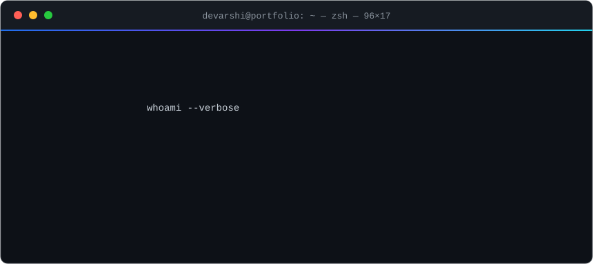
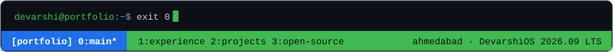

<div align="center">



<br />

<a href="#about"></a>
<a href="#stack"></a>
<a href="#experience"></a>
<a href="#projects"></a>
<a href="#open-source"></a>
<a href="#education"></a>
<a href="#telemetry"></a>
<a href="#contact"></a>

<br /><br />


</div>

<br />

```console
┌──(devarshi㉿portfolio)-[~]
└─$ ./boot-profile.sh --verbose

[  OK  ] Started identity.service
[  OK  ] Mounted /home/devarshi/projects
[  OK  ] Started agentic-ai.service
[  OK  ] Reached target rag-pipelines.target
[  OK  ] Reached target production-ready.target

Welcome to DevarshiOS 2026.09 LTS (GNU/Linux · ahmedabad-in)

 * Docs:      https://github.com/codeMaestro78
 * Contact:   devarshilalani.devflow@gmail.com
 * Tip:       run `cat about.md` to get started
```

## ~/about

```console
┌──(devarshi㉿portfolio)-[~]
└─$ neofetch

     ____                                devarshi@portfolio
    |  _ \  ___ __   __                   ------------------
    | | | |/ _ \\ \ / /                   OS ........ DevarshiOS 2026.09 LTS
    | |_| |  __/ \ V /                    Role ...... AI/ML Engineer · Full-Stack Engineer
    |____/ \___|  \_/                     Work ...... SDE @ acquire.io
    |  _ \| |                             Focus ..... Agentic AI · RAG · AI orchestration
    | | | | |                             Shell ..... Python · TypeScript
    | |_| | |___                          Location .. Ahmedabad, Gujarat, India
    |____/|_____|                         Edu ....... B.E. CS · L J University (2022–2026)
                                          Status .... Building systems that reason, retrieve, and ship
```

```console
┌──(devarshi㉿portfolio)-[~]
└─$ cat about.md

  AI/ML engineer building LLM-powered products, agentic workflows,
  and multi-tenant AI orchestration platforms.

  I work across the full product stack — LangChain, LangGraph, RAG and
  FastAPI services on the backend, React and Node.js on the front,
  plus data systems and cloud deployment.

  I care about grounded AI, reliable architecture, and turning
  prototypes into production systems people can actually use.
```

## ~/stack

<div align="center">


</div>

```console
┌──(devarshi㉿portfolio)-[~]
└─$ tree skills/ -L 2

skills/
├── agentic-ai/
│   └── LangChain · LangGraph · RAG · Tool Use · Guardrails
├── generative-ai/
│   └── OpenAI · Gemini · Hugging Face · Prompt Engineering
├── machine-learning/
│   └── Scikit-learn · TensorFlow · NLP · Embeddings
├── backend/
│   └── FastAPI · Node.js · Django · REST APIs
├── frontend/
│   └── React · TypeScript · JavaScript · Tailwind CSS
├── data/
│   └── PostgreSQL · Prisma · Redis · Pandas · NumPy
├── infrastructure/
│   └── AWS · Vertex AI · Docker · Vercel · Railway
└── languages/
    └── Python · TypeScript · JavaScript · Java · C++

8 directories, 0 excuses
```

## ~/experience

```console
┌──(devarshi㉿portfolio)-[~/experience]
└─$ git log --graph --oneline --decorate

* 2026-03..now   (HEAD -> main) Software Development Engineer · acquire.io
│   ├─ Building multi-tenant agentic AI orchestration features
│   ├─ Stack: LangChain · LangGraph · RAG · FastAPI · React
│   ├─ Designed tenant-level LLM usage metering and credit tracking
│   └─ Shipped product features incl. Stripe subscriptions
│
* 2026-01..03    ML Intern · fxis.ai
│   └─ Applied supervised, unsupervised, and deep-learning workflows
│
* 2025-02..06    ML Intern · Feynn Labs
    ├─ Built AI-assisted market-segmentation workflows
    ├─ Accelerated prospect identification by 40%
    └─ Developed an SME cash-flow forecasting system
```

## ~/projects

```console
┌──(devarshi㉿portfolio)-[~/projects]
└─$ ls -lah --featured

total 4
drwxr-xr-x  01  AllotIQ ..................  agentic IPO intelligence + portfolio platform
drwxr-xr-x  02  MLCLI-Toolkit ............  open-source ML/DL training CLI (pip package)
drwxr-xr-x  03  AlphaVista ...............  AI-assisted stock analysis platform
drwxr-xr-x  04  Blockchain-Transaction-UI   open-source TypeScript/React npm package
```

| # | Project | What it does | Stack |
| :-: | :-- | :-- | :-- |
| 01 | **[AllotIQ](https://allotiq.in)** | Evidence-backed analyst reports, grounded AI chat, deterministic apply / wait / avoid scoring, citation validation and hallucination guardrails | `LangChain` `GPT-4o-mini` `FastAPI` `Next.js` `PostgreSQL` |
| 02 | **[MLCLI Toolkit](https://github.com/codeMaestro78/MLcli)** | Modular CLI and TUI for ML training, evaluation, model registry, explainability, and experiment tracking | `Scikit-learn` `TensorFlow` |
| 03 | **AlphaVista** | Stock analysis with price prediction, VADER sentiment, and live market APIs | `Python` `VADER` `Redis` |
| 04 | **Blockchain Transaction UI** | npm package with wallet connection and live transaction-state components | `TypeScript` `React` |

## ~/open-source

```console
┌──(devarshi㉿portfolio)-[~/open-source]
└─$ git shortlog -sn --all --author="codeMaestro78"

  Fixes and infrastructure improvements to tools used across
  production ML and developer workflows.
```

| Project | Domain | Contribution |
| :-- | :-- | :-- |
| **[google-gemini/gemini-cli](https://github.com/google-gemini/gemini-cli)** | React · Ink · TypeScript CLI | [Issue #7564](https://github.com/google-gemini/gemini-cli/issues/7564) — diagnosed and resolved TUI dialog flickering in `/settings` |
| **[Netflix/metaflow](https://github.com/Netflix/metaflow)** | Python · ML infrastructure | [Closed PRs](https://github.com/Netflix/metaflow/pulls?q=is%3Apr+state%3Aclosed+author%3AcodeMaestro78) — bug fixes and infra improvements for ML orchestration |
| **[HSF/phoenix](https://github.com/HSF/phoenix)** | C++ · High Energy Physics | [PR #763](https://github.com/HSF/phoenix/pull/763) — core framework enhancements and event display bug fixes |
| **[codeMaestro78/MLcli](https://github.com/codeMaestro78/MLcli)** | Python · TUI · ML | Built a modular CLI/TUI toolkit for ML training, evaluation, and tracking |

## ~/education

```console
┌──(devarshi㉿portfolio)-[~]
└─$ cat education.yml

university: L J University, Ahmedabad
degree: B.E. Computer Science and Technology
duration: Nov 2022 — Sept 2026

certifications:
  - MLOps for Generative AI ............... Google Cloud · Apr 2025
  - AWS Cloud Technical Essentials ........ Coursera · Mar 2025
  - Exploratory Data Analysis for ML ...... Jan 2025
```

## ~/telemetry

```console
┌──(devarshi㉿portfolio)-[~]
└─$ htop --user=codeMaestro78
```

<div align="center">


<br /><br />


<br />


</div>

## ~/contact

```console
┌──(devarshi㉿portfolio)-[~]
└─$ ssh connect@devarshi

Connection established.

  LinkedIn ... linkedin.com/in/devarshilalani05
  GitHub ..... github.com/codeMaestro78
  Email ...... devarshilalani.devflow@gmail.com

Let's build something meaningful.
```

<div align="center">

<a href="https://linkedin.com/in/devarshilalani05"></a>
<a href="https://github.com/codeMaestro78"></a>
<a href="mailto:devarshilalani.devflow@gmail.com"></a>

<br /><br />



</div>
